# Automatic-Image-Colorization 

Our task is to convert given grey-scale image into colorized(RGB) image.

[![Build Status][travis-image]][travis-url]

## Introduction

Given a grayscale image input, our objective is to find out its believable color image without any manual intervention. Accomplishing this task is a difficult problem because there is often no “correct” attainable color for a given image as the color of the t-shirt can be anything from white to red or black.  

## Lab Color Space

It is also known as [CIELAB color space](https://en.wikipedia.org/wiki/CIELAB_color_space). 

It is expressed in three numerical values *(L,a,b)* as
- **L(Luminance)** for the lightness 
- **a** for the green–red color components
- **b** for the blue–yellow color components

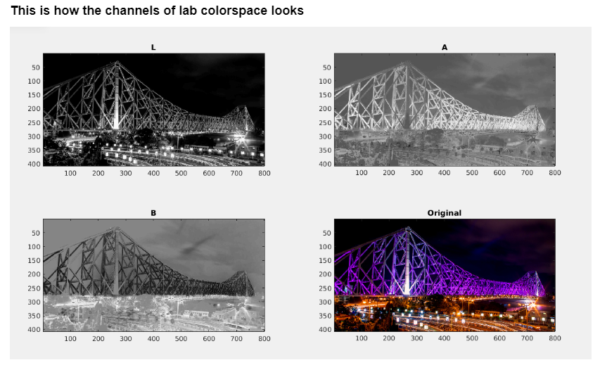

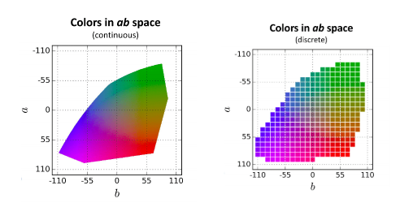

Each and every image while training phase is first converted to the Lab color space then passed it further for processing. The Luminance(L) channel is nothing but the grayscale image of the color image given for the training.

>*Why do we use Lab color space?*
>
> -The reason for using this over RGB because euclidean distance in Lab is more similar to how humans perceive color differences[[2]](http://cs229.stanford.edu/proj2013/KabirzadehSousaBlaes-AutomaticColorizationOfGrayscaleImages.pdf).

## Approaches

Here to build a solution, we are exploring various options from traditional hand-picked features to modern deep learning techniques.

### 1. Feed Forward Neural Network

As the *Luminance*(**L**) channel is the grayscale image we have to find out channel **a** and **b**. 

#### i) Regression Problem

Here we treat the problem of predicting ab from L as a *Regression problem*, we train two Separate MLP with (500,400,300) number of Units in the 3 hidden layer and try to predict **a** and **b**. 
Here we first resize the image to (200,200) size and then feed each pixel value into the Neural Net and solve the problem like a regression.

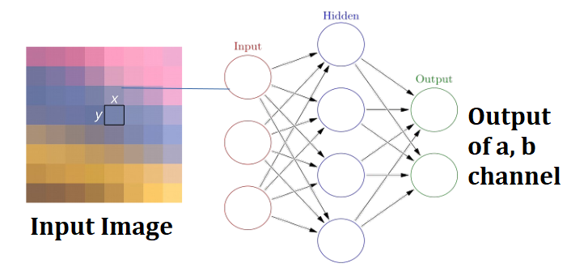

> **Simple Feed Forward Neural Network takes pixel as input gives a,b value as Output.**

**Observation:** The result we get is nowhere near great, but still, we can feel some sort of colorization. It is because only the pixel’s intensity is not enough to predict the color as *Lab color space is a decorrelated colorspace there is no correlation between the L and ab channels*.

**Code:** `Naive_Fully Connected Network.ipynb`

#### ii) Classification Problem

First, we discretize the color space to 8x8, by dividing every pixel value with 32 and rounding off to the nearest integer.
Here as a feature, we take the L values of a patch of size 3x3 around the pixel, our feature size becomes 9 values and we try to classify each pixel in one of 64 ab value.

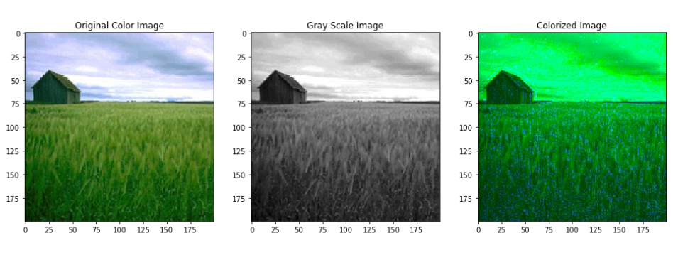

**Observation:** It is not enough to only pass the raw pixels of the 3x3 patch around the particular pixel. One reason why this is failing can be due to the flattening of the 3x3 feature matrix we are doing to feed it to the neural network, that way it *loses all the spatial information*.

**Code:** `Neural_Net_2.ipynb`

### 2. Combination of Feed Forward Neural Network and Hand Picked Features

Limitation of Data and computation resource we look into hand-picked features, we followed most of the approach from this paper[1]. Here we used the CVCL MIT Opencountry Dataset [[link]](http://cvcl.mit.edu/database.htm). We took a subset of images (11 images) used that to do the training and we used another subset of 10 images to colorize.

**Training Set**

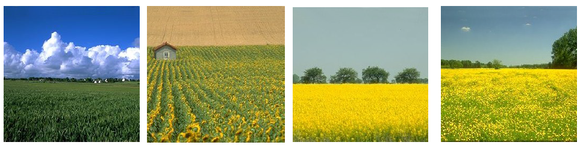

**Test Set**

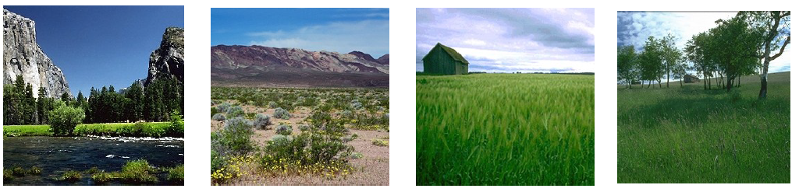

**Flowchart:**

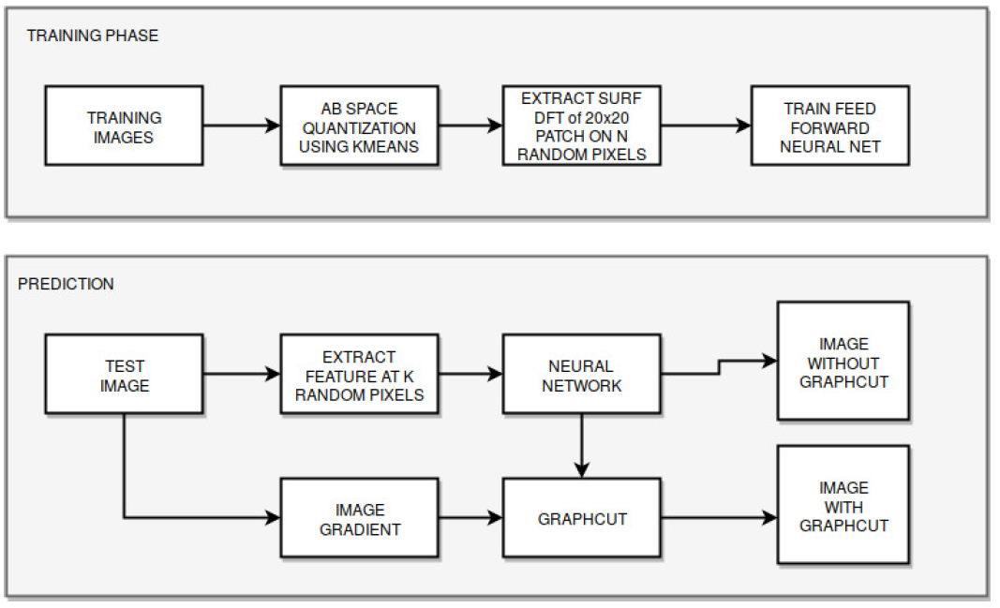

> **Note-** Here we use Neural Network instead of SVM. Also, we didn’t use PCA(as shown in the paper), instead of reducing the dimension we directly feed the features to the Neural Network.

**Outputs:**

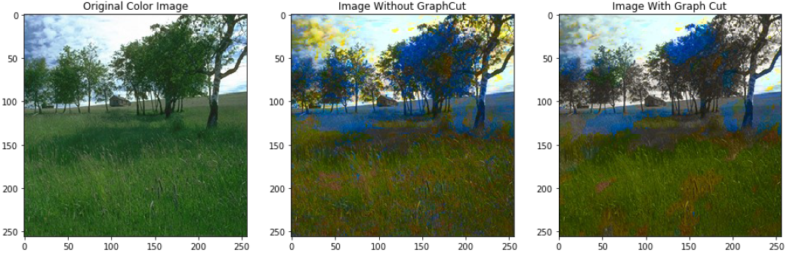

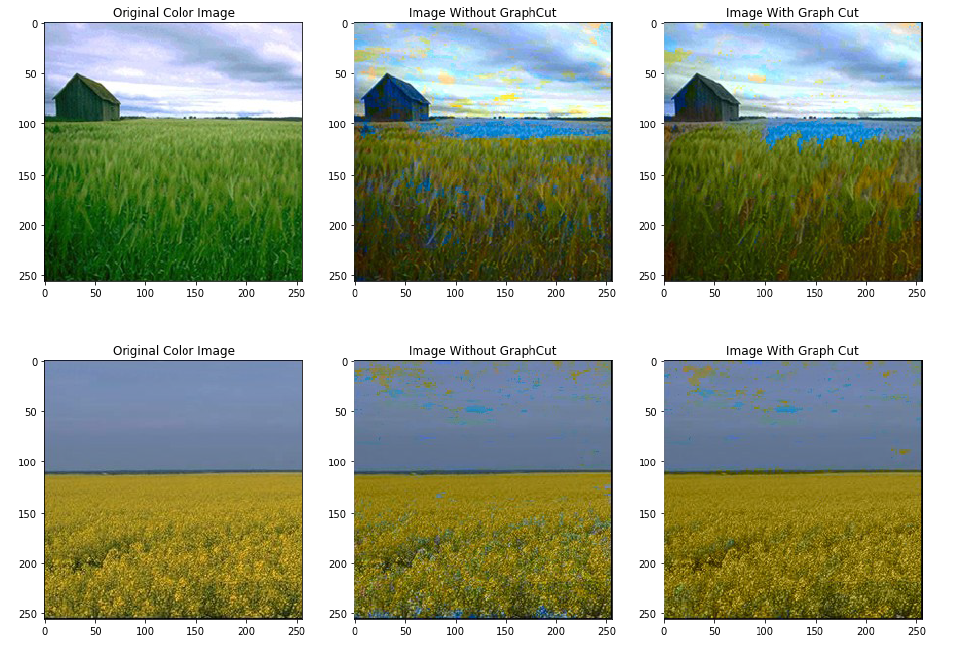

**Observation:** The main problem with this method is there are a lot of discontinuous patches around. We applied [MedianBlur](https://en.wikipedia.org/wiki/Median_filter), but that was also not able to solve this issue.

**Code:** `SURF_APPROACH.ipynb`

### 3. Convolutional Neural Network (CNN)

Now instead of hand picking features with feature descriptor SURF, we tried to use CNN to eliminate the feature extraction step. 
Our CNN works the same way like the previous method, Only for each randomly selected pixel instead of taking feature in 20x20 window size, we take the whole patch, normalize it and feed it into a CNN. 
Here we used the [VGG 16](https://www.kaggle.com/keras/vgg16) model, we trained the model with same sets of images as the training set.

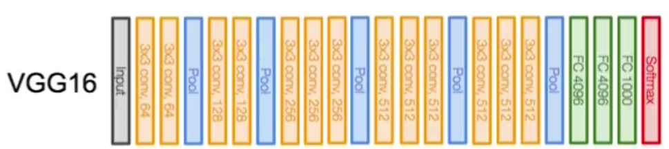

**CNN Architecture Overview:**

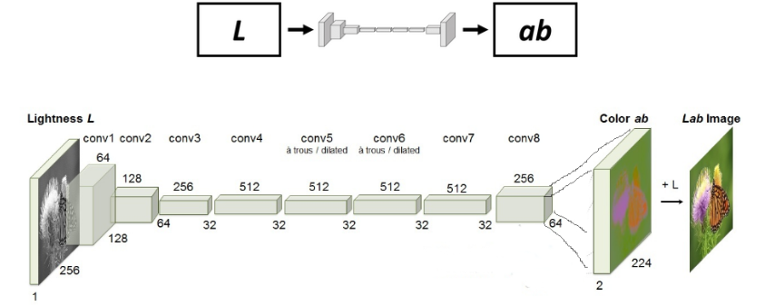

**Outputs:**

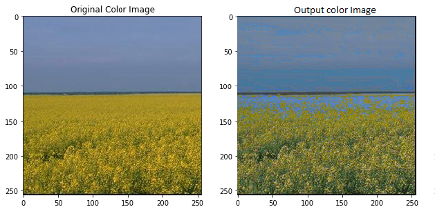

**Observation:** Training the CNN requires large no of data points, as we are using the CNN in the pixel patch level, we take around 2000 pixels from each of the 10 images of patch size 48x48. Also, CNN requires a lot of computation resources for this task and lot of parameter tuning.

**Code:** `CNN_patch.ipynb`

## Best Result

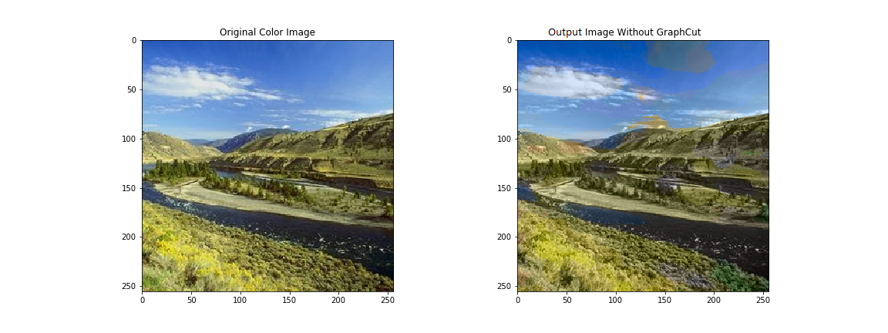

## Dependencies

	python3.5
	cv2
	sklearn
	scipy
	numpy

## References

1. [Colorful Image Colorization](https://arxiv.org/pdf/1603.08511.pdf) by Richard Zhang, Phillip Isola, and Alexei A. Efros
2. [Automatic Colorization of Grayscale Images](http://cs229.stanford.edu/proj2013/KabirzadehSousaBlaes-AutomaticColorizationOfGrayscaleImages.pdf) by Austin Sousa, Rasoul Kabirzadeh, and Patrick Blaes

  
## Interesting Application To do

- [Transferring Color to Greyscale Images](https://dl.acm.org/citation.cfm?id=566576) by Tomihisa Welsh, Michael Ashikhmin, and Klaus Mueller

<!-- Markdown link & img dfn's -->
[travis-image]: https://img.shields.io/travis/dbader/node-datadog-metrics/master.svg?style=flat-square
[travis-url]: https://travis-ci.org/dbader/node-datadog-metrics

